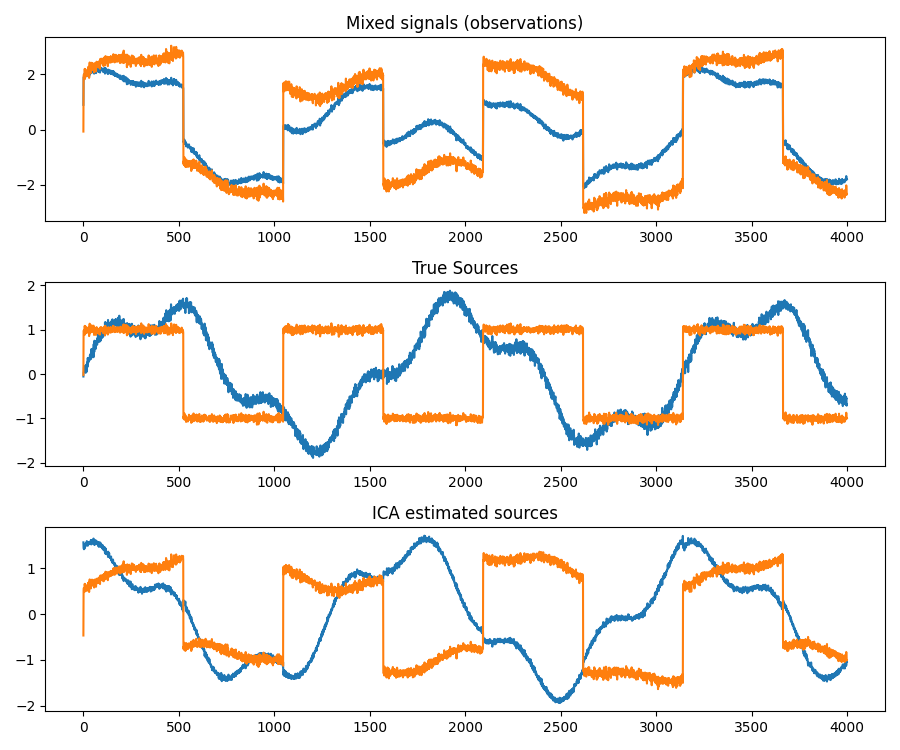
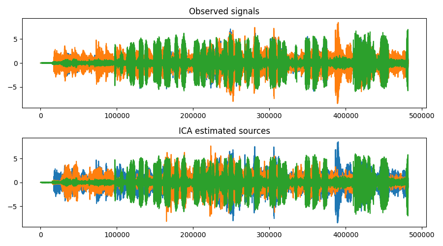

# Independent Component Analysis (ICA) demo

This project demonstrates how Independent Component Analysis [ICA](https://en.wikipedia.org/wiki/Independent_component_analysis) works using Python and [scikit-learn](https://scikit-learn.org/stable/). 

## Synthetic signals demo
Mixes a composition of three sine waves with a pulse signal and then adds some noise. Two versions with different amplitudes and delays are mixed for the two receivers. Last, the two recordings are fed into ICA which reconstructs the original signals.



## Radio recordings demo
Mixes and separates real radio broadcasts. There are three clips which were mixed together three times, one for each receiver.

- `receiver1.wav`: all three WAVs mixed equally
- `receiver2.wav`: no changes were made to cowbells, horse races were delayed by 20ms and the volume was reduced by -10dB, interview delayed by 40ms and volume reduces by -20dB
- `receiver3.wav`: cowbells were delayed by 40ms and volume reduced by -20dB, horse races were delayed by 20ms and the volume was reduced by -10dB, no changed so the interview clip.




## What is ICA?
ICA is an algorithm that isolates signals from signal mix, as long as you have at least as many mixed signals as sources. For example, two antennas at different locations pick up two radio stations broadcasting on the same frequency. Each antenna receives a different mix. ICA can separate the original broadcasts.

## Running the demos
1. Create and activate a virtual environment:
   ```bash
   python3 -m venv venv
   source venv/bin/activate
   ```
2. Install dependencies:
   ```bash
   pip install -r requirements.txt
   ```
3. Run a demo:
   ```bash
   python ica_demo_simple_signals.py
   # or
   python ica_demo_real_signals.py
   ```
Both demos save their charts as PNGs in the same folder. The real signals demo saves the reconstructed signal `audio/reconstructed`.

## Results and discussion

### Synthetic signal
The composite sine wave of the synthetic signal is reconstructed fairly well. The pulse signal is reconstructed in principle, the base frequency and phase are correct, but the pulse is slightly deformed.

### Radio recordings

Overall, ICA isolates the source signals well. While it's not visible in the chart, the reconstructed audio clips show that long streaks of silence are filled with sound from the other signals, eg. the first two seconds of [reconstructed_source_3.wav](audio/reconstructed/reconstructed_source_3.wav)

## Licenses and Credits
- Interview: Brennan, Jennifer, and Donald Brennan. [Library of Congress](https://www.loc.gov/item/afc911000148/)
- Cowbells, Horse race: BBC, [BBC Sound Effects](https://sound-effects.bbcrewind.co.uk/licensing)
- Code: MIT License
